# World_Weather_Analysis
Module 7 Challenge

## Overview of Project

Due to it's aging employee population and it's antiquated 'database' system, Pewlett-Hackard finds itself unprepared for what they are calling a 'Silver Tsunami' of employees retiring as they have the perfect combination of age and years of service that may compell them to retire.  A concern so overwhelming, they have enlisted our services to update their database systems and conduct an analysis to provide better visability of the situation and possible solutions to assist in an transition that may occur if their aging team members decide to retire.

### Purpose

The purpose of this challenge is to apply our database and query skills, coupled with analytics that can provide insight their current situation of the employee population and possible recommendations.

## Results

### Deliverable 1: Retrieve Potential Retiring Employees and Titles
The purpose of the first deliverable is to compile a list of employees, their titles and Pewlett-Hackard start dates based on their year of birth.  This will help the executive team access how many team members are nearing retiremnt age and the positions they currently hold.  With this information, Pewlett-Hackard can put together an action plan and a roadmap to navigate through this possible transition  

* Below is the 'Retirement Titles Query' that pulls back all employees and titles nearing retirment age.  

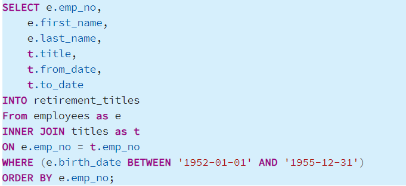

* Based on the 'Retirement Titles Output' below, we can see that the limitation of this data is there are many duplicate entries with regards to names as Pewlett_Hackard employees have held many positions over the years.  We will need to limit the data set to only include the most recent position held by employees of interest.

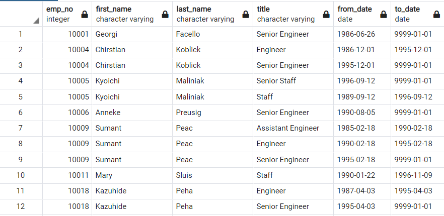

* Unique Titles Query was created to return only the most recent title held by the employees that are nearing retirement age.

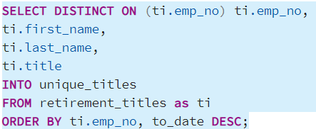

* Unique Titles Output table below shows the result of the above query.  Please note that all duplicate employee names have been removed.

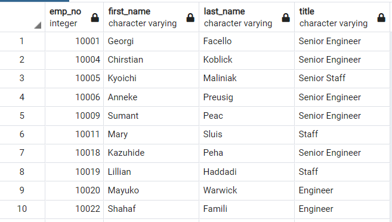

* The resultant table above in it's entirety is still quite a large data set and would take the executive team a long time to analyze and put together an action plan.  To assist the executive team we created a 'Retiring Titles Query' table to quickly summarize the data and present an overview of the number of employees that could retire based on their titles. The query below was constructed to return that information.

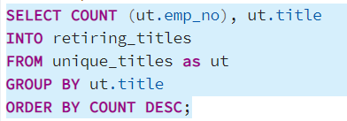

* Using the query above, the 'Retiring Titles Ouptut' table below highlights that it is quite possible that Pewlett-Hackard could potentially lose a large number of very experienced employees.

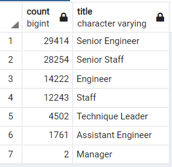

### Deliverable 2: Identify Potential Mentorship Candidates and Current Titles
After acquiring the data regarding employees that are nearing retiring age, the Executive team requested data on team members are currently with the company and could be mentored and eventually take over for those who will retiring.  The query below was created to pull that information and place it in a mentorship eligibility table.

* Mentorship Eligibility Query below pulls team members that are nearing the retirement age but, could benefit from being mentored by the employees that could retire, or could also benefit by taking on a mentorship role for those who are not yet nearing retirement.

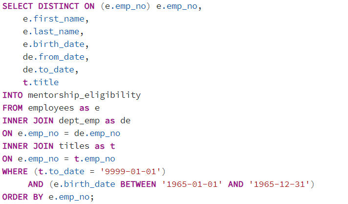

* Based on the query above, the 'Mentorship Eligibility Output' below shows a sizeable difference from those who are on the verge of retiring and those who may be groomed to replace them as they leave.

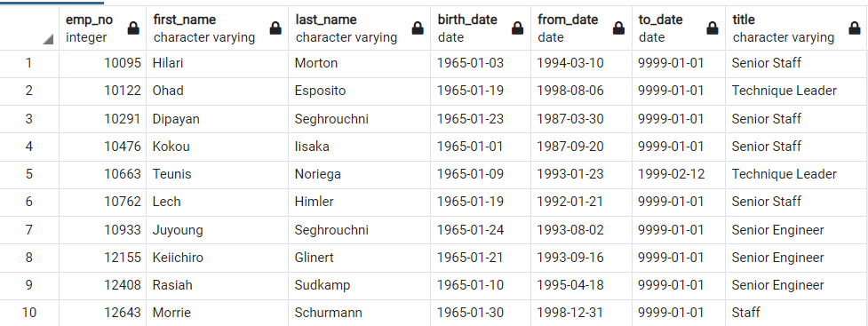

Although by looking at the two outputs, 'Retiring Titles Output' and 'Mentorship Eligibilty Out' do show a pretty concerning result, we feel that it would help the executive team if we provide visuals to help highlight the situation they could be facing.

### Retirement vs Mentorship
To provide better clarity to the Executive team, we decided to run two additional queries to get a better understanding of how many people could be leaving Pewlett Hackard in the near future compare to those who are ready to mentor or be mentored.  The first query below returned information regardin which departments will feel the greatest impact if the 'Silver Tsunami' were to happen at once.  The second query returned how many people from each department were identified as those ready to be mentored by those that are retiring and in-turn mentor those with less experience.  By creating visuals this will help the executive team understand which departments could face the greatest exodous of employees and if there are enough skilled members to replace them.

* This query was created to return total retirment ready individuals by department

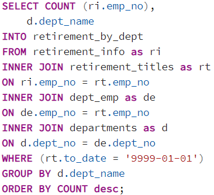

* 'Total Retirement Ready Individuals by Department' output only re-inforces that fact that the 'Silver Tsunami' is not isolated to one department but, is spread across all departments. However, it does appear that there are departments that will be hit harder than others.  More on that later in this report.

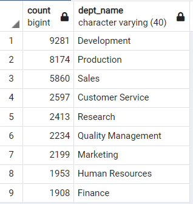

* This query used to return total number of individuals, by department,  that were born in 1965 as they have been identified by the executive team as mentorship ready individuals.

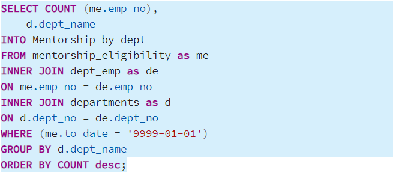

* The total mentorship ready individual output below does show that each department has individuals that could be mentored or ready to mentor other, in time of transition however, a direct comparision will need to be made to see if there are still gaps.

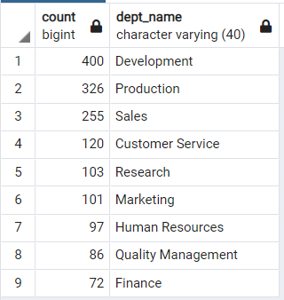

* Knowing that all departments will be impacted differently by this potential Tsunami, we created a pie chart displaying which departments will be impacted most, on a percentage basis, if the Tsunami hits.  This chart below does a nice job of drawing the readers eye in and quickly access which departments will need to move the quickest.

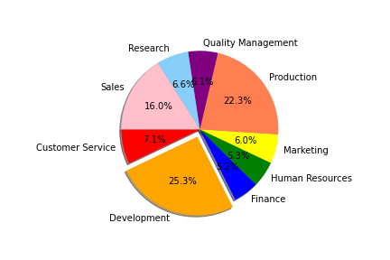

* To take it a step further, we merged the two mentorship and retirement tables and created a bar chart so that he executives can get a better sense of scale as to how may people could be leaving the company and those that have been identified for a role in mentorship.  These two visuals, the bar chart and pie chart, will convince that Pewlett-Hackerd will have to put together a plan quickly to stem the impact if this Tsunami were to happen sooner than laer.

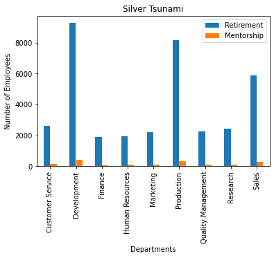

## Summary
Upon reviewing the data above and reviewing what other companies have done when face with similar situaitons, we have developed the following recommendations

* First, reach out to those identified as ready for retirement and get a sense of when they actually plan to retire
* Develop short term incentives to motivate the individuals identified as part of the 'Silver Tsunami' to delay their retirement
**  This can be done through offering them part time status to allow them more time off
**   Another option is to develop and enact a mentorship program that will allow these individuals to bring up less experienced team member
* Develop long term incentives that will help in the short term but, also prevent this from happening in the future
**   A well defined mentorship program that is supported by corporate that becomes part of the companies cultures.
* Create a Volunteer Seperation Package(VSP) that is once again rolled into the corporate benefits package and takes root in the company culture
**   Once an individual meets an age and years of service requirement, they are eligible to receive an incentive package to leave the company(like a golden parachute), provided they are in good standing with the company and they give a 12 - 18 month notice of their intent to retire.  Once notice is given, this will give time for the management team to groom this individuals replacement.

These are some of the suggestion that will be presented to the team to dampen this 'Silver Tsunami'.  Keeping the more experienced team involved can be beneficial in so many ways. Many of these individuals have experience that can not be learned by reading process documents and structured training. By providing them with an opportunitiy to mentor, work part time, and take part in a VSP their experience stays within the company and passed onto others. These individuals have a vested interest in sharing their knowledge with those within Pewlett-Hackard and not to competitors.
